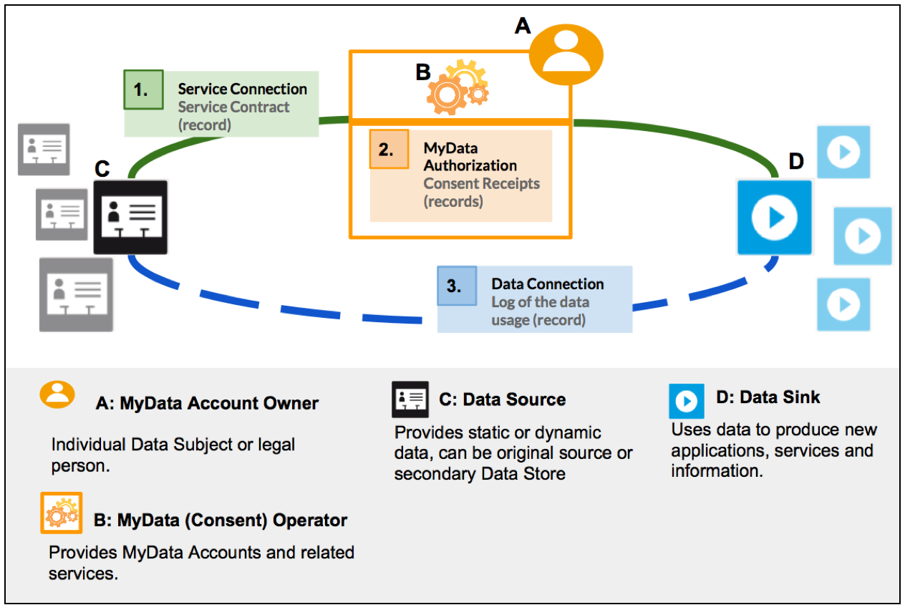
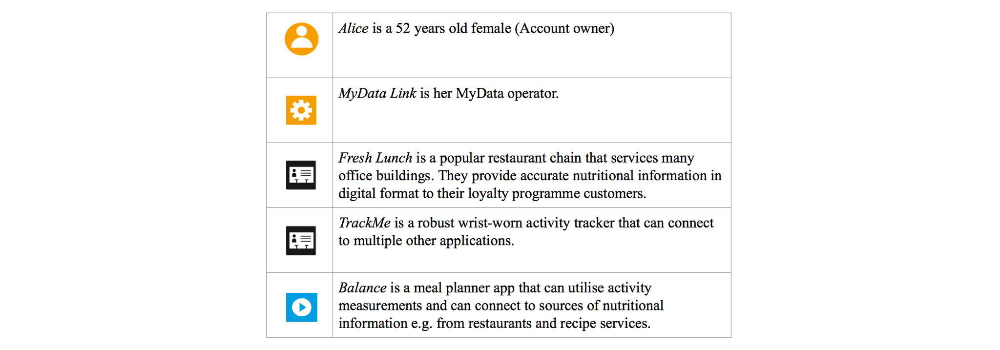
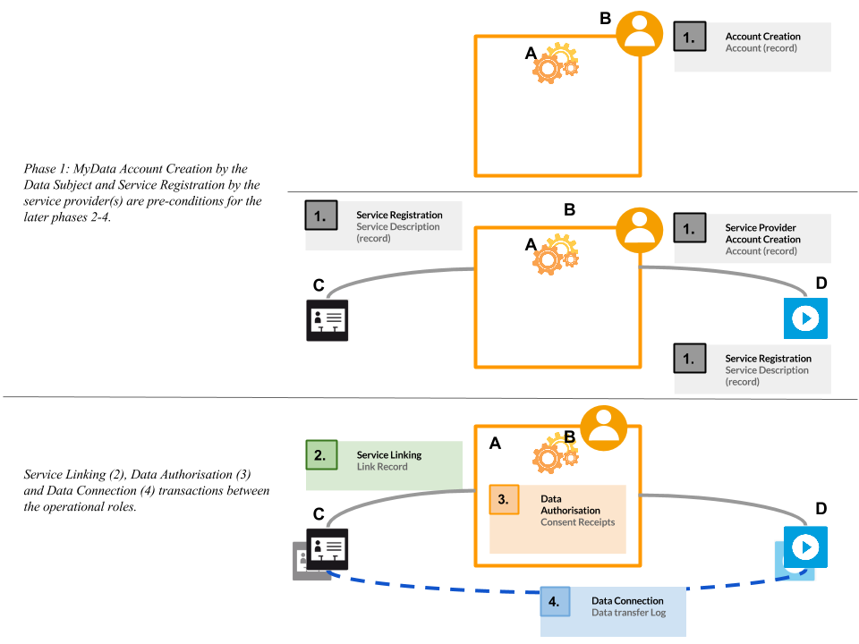

**Authors:**

| Anette Alén-Savikko	Aalto University / Helsinki Institute for Information Technology HIIT
| Nomi Byström          Aalto University / Helsinki Institute for Information Technology HIIT
| Harri Hirvonsalo      University of Oulu
| Harri Honko           Tampere University of Technology
| Antti Kallonen		Tampere University of Technology
| Yki Kortesniemi       Aalto University / Helsinki Institute for Information Technology HIIT
| Kai Kuikkaniemi       Aalto University / Helsinki Institute for Information Technology HIIT
| Tuomas Paaso          VTT Oy
| Olli Pitkänen         Aalto University / Helsinki Institute for Information Technology HIIT
| Antti Poikola         Aalto University / Helsinki Institute for Information Technology HIIT
| Samuli Tuoriniemi     University of Oulu
| Sari Vainikainen      VTT Oy

**Version:**

| 1.1.0 (March 7th 2016)
| See updated versions from:[hiit.github.io/mydata-stack](https://hiit.github.io/mydata-stack/)

\newpage

**Notice** 

This document has been prepared by Participants of Digital Health Revolution research program and is licensed under a Creative Commons Attribution-ShareAlike 4.0 International License.

Implementation or use of certain elements of this document may require licenses under third party intellectual property rights, including without limitation, patent rights. The Participants of and any other contributors to the Specification are not and shall not be held responsible in any manner for identifying or failing to identify any or all such third party intellectual property rights. This Specification is provided "AS IS," and no Participant makes any warranty of any kind, expressed or implied, including any implied warranties of merchantability, non-infringement of third party intellectual property rights, and fitness for a particular purpose.

MyData Architecture defines the operations and APIs between the Operational Roles (Operator, Source, Sink etc.). Any descriptions or figures of the role’s internal structure or operations are for illustrative purposes only.

\newpage

# 1. Introduction

Applications and services collect increasing amounts of personal data about their users, and leverage it to extract valuable knowledge about them. This information can be used for providing new services and for profiling individuals, and the results are monetizable input for e.g. targeted advertising. Unfortunately, individuals themselves typically have little or no control over how their data is created or used. 

This document presents the MyData architecture, a human centric approach to liberate the potential of personal data and to facilitate its controlled flow from multiple data sources to applications and services. The simple core idea, the *individual in control of their own data*, is both a movement for digital human rights and an initiative for opening new business opportunities. It responds on a practical and technical level to individuals’ growing demand for control over their personal data and to organizations need to fulfill the requirements of tightening data protection regulation. Though both of these goals can be achieved within the current legal framework, the lack of interoperable implementations has kept them mostly a distant goal - a situation that we now want to change.

The legal framework[^1] for protecting personal data usually starts with a freely given, specific, informed and unambiguous consent. In order for their personal data to be processed, the individual has to make a conscious choice to give consent to the external organization to process data. The consent has to be withdrawable, readable by involved trusted parties, and it should be stored in appropriate place for validity checking by the parties using or providing person’s data. This is the exact premise chosen as key guiding rule of the developed MyData model.

[^1]: In this document we use the upcoming EU General Data Protection Regulation (GDPR) as example and detail it further in a separate info box.

The architecture aims to provide a standard for implementations that

* satisfy the legal requirements for processing of personal data and, thus, prevents unwanted and improper processing of the individual’s personal data 

* enable the individuals to easily grant and withdraw their consent for data processing

* provide transparency to individuals about how their data is being used

* enable flexible service creation and new business opportunities

In the following sections we present an overview of the MyData architecture (Section 2), and detail the key parts of the architecture: Service Registry and Service Discovery (Section 3), Service Linking (Section 4), Authorisation (Section 5), and Data Connection (Section 6). Each detail Section has a corresponding detailed technical document (see References).

This is the second (v1.1) version of the specification and will be developed upon feedback.

\newpage

## Legal Framework for Personal Data Processing in EU

The processing of personal data is governed by applicable legislation; for MyData architecture documentation, we use the upcoming EU General Data Protection Regulation (GDPR[^2]) as the example. A number of legal roles relating to personal data processing, most importantly the data subject, the controller, and the processor, all of which are subject to differing rights and obligations, are defined in Art. 4 GDPR. Moreover, the notion of personal data is defined as "any information relating to an identified or identifiable natural person" (the data subject) (Art. 4(1)). Data controllers and data processors are either natural persons or legal persons, public authorities, agencies, or other bodies (Art. 4(5)-(6)). The former means the entity which “alone or jointly with others determines the purposes and means of the processing of personal data” whereas the latter “processes personal data on behalf of the controller”. The notion of processing is wide: according to Art. 4(3) GDPR, processing signifies “any operation or set of operations which is performed upon personal data or sets of personal data, whether or not by automated means, such as collection, recording, organization, structuring, storage, adaptation or alteration, retrieval, consultation, use, disclosure by transmission, dissemination or otherwise making available, alignment or combination, restriction, erasure or destruction”.

[^2]: Latest version available at [http://static.ow.ly/docs/Regulation_consolidated_text_EN_47uW.pdf](http://static.ow.ly/docs/Regulation_consolidated_text_EN_47uW.pdf)

Processing of personal data requires a legal basis and there are several possible bases (cf. esp. Arts 6, 9 GDPR). However, from the point of view of self-determination of the data subject, consent signifies an especially important legal basis. According to the GDPR (recital 25; Art. 4(8)), consent means an indication of the data subject’s wishes by which they signify agreement to the processing of their personal data, either by statement or by “clear affirmative action”; consent must be freely given, specific, informed and unambiguous. Article 7 GDPR provides the framework for consent: first, the controller must be able to demonstrate the existence of consent. Second, in the context of written declarations containing also other matters, consenting must be clearly distinguishable, accessible and understandable in order to be binding. Third, the data subject can always withdraw their consent and this must be as easy as consenting. The lawfulness of processing prior to withdrawal is not affected. Fourth, in assessing the free nature of consent, particular account is to be taken of whether the performance of a contract, including provision of a service, is made conditional on the consent to processing of unnecessary data (i.e. not necessary for the performance of the contract). Prior to consenting, the data subject must be informed while duties related to information are vested on the controller (cf. e.g. Arts 12, 14 GDPR). With children below the age of 16 (or depending on national level solutions all the way to the age of 13) parental oversight is required with consenting (Art. 8) in relation to information society services[^3] offered directly to a child; processing is lawful on the basis of consent and to the extent authorized. 

[^3]: According to Art 4(20), the definition of an ‘information society service’ corresponds to that of Art. 1(2) of Directive 98/34/EC, i.e. a service normally provided against payment, at a distance, electronically, and at the recipient’s request. Services relying solely on advertising revenue also meet the first requirement.

Furthermore, special categories of personal data, according to Art. 9 GDPR, include those concerning racial or ethnic origin, political opinions, religious or philosophical beliefs, and trade-union membership, as well as genetic data, and data concerning health or sex life. The processing of such data is prohibited unless one of the grounds listed in Art. 9 applies, including explicit consent.

However, consent cannot legitimise all sorts of processing activities, nor can it negate obligations stemming from general principles related to processing of personal data, such as the purpose limitation (Art. 6 DPD; cf. Art. 5 GDPR). Consent is one possible ground for processing personal data and does not always constitute the most appropriate ground. However, when used appropriately it enables data subjects’ control over their data[^4]. In MyData architecture, all data transactions and processing are based on consents from data subjects, and it is possible to change or withdraw the consent at will.

[^4]: See WP187 Opinion 15/2011 on the definition of consent, July 13, 2011, p. 2, 7-8: [http://ec.europa.eu/justice/policies/privacy/docs/wpdocs/2011/wp187_en.pdf](http://ec.europa.eu/justice/policies/privacy/docs/wpdocs/2011/wp187_en.pdf). The opinion was issued in connection to the Data Protection Directive (95/46/EC; DPD).

\newpage

# 2. MyData Architecture overview

This section first summarises the core concepts from MyData Whitepaper [1] and then provides an overview of the MyData architecture by introducing the transactions, an example use case, and key related standards. The goal is to help understand systems built according to MyData principles without going too deeply in the technical implementation details; technical documentation and code release of a reference implementation of a MyData architecture is provided separately [2-5].

## 2.1 Core Concepts

At the heart of MyData are four operational roles and the MyData Account as shown in Figure 2.1.

*Figure 2.1: **Four operational roles within the MyData architecture include 1) individual as the Account Owner 2) MyData Operators, 3) Sources, and 4) Sinks. The MyData Account is hosted by the Operator. Note that the flow of authorisations to use the data is separate from the flow of data.*

### 2.1.1 MyData Account

A key human centric concept in MyData architecture is a portable **_MyData Account_**, which contains individual’s digital identity or identities, linked services, and authorisations. Potentially, these are complemented with individual’s other data that help in providing additional or improved services. Functionally, MyData Account is the key enabler in authorising, controlling and logging the data flow between multiple services. Portability of the MyData Account is deferred to a later architecture release.

The Account is hosted by an independent MyData Operator role. It is expected that most of the operator services will be provided by organisations, though it is also possible for individuals to run the operator software themselves thus becoming self-operators. The key difference is that organisations can potentially provide additional trust, assurance and security levels compared to a self-operator. Acceptance and audit process for an organization wishing to serve as a trusted operator are beyond the scope of this document[^5]. 

[^5]: It is likely to be defined along extending the criteria set for entering e.g. a regional or governmental trust network - [ISO/IEC 29115](https://www.idmanagement.gov/IDM/s/) entity authentication assurance level or [FICAM TFS](http://www.iso.org/iso/catalogue_detail.htm?csnumber=45138) are examples of trust and assurance level related requirements that may apply.)

### 2.1.2 Operational Roles

There are four key operational roles in the My Data architecture: *Account Owner*, *MyData Operator*, *Source* and *Sink*. Actors (organisations and individuals) may work in one or many of the operational roles. It is e.g. very typical for an organisation to simultaneously be in the role of Source and Sink. 

**_Account Owner_** is the individual who created and is using the account to link new services (see *Service Linking*) and authorise data flow (see *Authorisation*). Account Owner is usually the Data Subject as defined in Data Protection legislation. One Data Subject may have multiple accounts hosted by the same or different Operators.

Main purposes of the **_MyData Operator_** are to host MyData Accounts as well as the user interface for managing those accounts. Operator also has to provide the underlying mechanisms for linking Sources and Sinks to the account, and managing the account specific authorisations. The basic vision of the architecture enables the existence and use of multiple operators. Each individual can choose to use one or more operators to manage their authorisations.

**_Source_** is an entity that can, when authorised, provision Account Owner’s data to one or more Sinks and, correspondingly, **_Sink_** is an entity that can, when authorised, fetch data from one or more Sources and use the data to produce the agreed services. Both Sources and Sinks need to provide the corresponding MyData-compatible interfaces. Source interfaces enable the management of data provisioning, while Sink interfaces enable the management of data usage. It is quite common that a service is working both as Source and Sink, and providing, therefore, both Sink and Source capabilities and interfaces.

### 2.1.3 Mapping the operational roles with legal roles

For clarity, it is important to map the operational roles Account Owner, Source and Sink with the corresponding legal roles - Data Subject, Data Controller and Processor. The GDPR legal framework only covers cases of personal data where the Data Subject is a natural person, but the MyData architecture technically may be used also for managing other data.

When the Account Owner is a natural person and their data is being processed, the Account Owner is the Data Subject. The other legal roles in MyData system can be then determined by answering two questions:

1. Who determines the purposes and means of the processing of personal data?

2. Who actually processes the data?

Two typical cases as shown in Figure 2.2 are:

* **Delegation:** With Account Owner’s consent, Sink accesses personal data from the Source and processes it for the defined purpose. In this case, both the Source and the Sink are in legal terms Data Controllers.

* **Repurposing:** Service is processing personal data for a specified purpose within its own scope - at some point the service may suggest for the Account Owner a new purpose or means of processing data. In this case the Service is in legal terms the Data Controller.

*Figure 2.2: Examples how MyData approach can support different kinds of data flow use cases such as delegation and repurposing.*

## 2.2. Use Case

This example use case is presented to illustrate the possibilities of MyData architecture. The case covers a scenario, where *Alice* authorises a new service *(*imaginary service *Balance)* to access her data from other compatible services *(*imaginary services* Fresh Lunch and TrackMe)* using her Operator (imaginary service *MyData Link)*.

Prerequisites:

* Fresh Lunch, TrackMe and Balance are already known services at MyData Link

* Alice has an account at MyData Link

* Alice has an account in TrackMe, and she has the service on her account at MyData Link

Story:

Alice gets a tip about a new application "Balance" for her mobile phone from her personal trainer Bob and decides to try it out.

Balance is MyData compatible and, thus, it asks Alice, if she already has a MyData Account with which to *link*, or if she would be interested in creating a new account with a recommended operator. Alice picks the ‘Link existing account’ choice and authenticates to her account at MyData Link from within the Balance app.

The Balance app then suggests that Alice links also her activity tracker and restaurant bill data, as access to these would improve the use of the app. However, Balance can be used also without these enriching data sources. By using the embedded MyData Link user interface within the Balance app, Alice *authorises* the Balance app to access her data from TrackMe, but leaves the restaurant bills out.

Later Alice logs in to her operator MyData Link and sees that the recently connected Balance app now appears on the list of her services. User Interface of the MyData Link operator has functionality for *discovering* compatible services amongst those the operator has on its service listing. With that Alice finds out that Balance app could also use data from the Fresh Lunch restaurant chain. Alice decides to subscribe to Fresh Lunch’s loyalty program, link Fresh Lunch to her account at MyData Link, and authorises the Balance app to access her restaurant bill data.

After authorizations are granted, the Balance app fetches the data from the API interfaces offered by TrackMe and and Fresh Lunch using a *data connection*. Balance app then uses Alice’s data to provide infographics of her nutritional behaviour versus her current health state and targets.

## 2.3. Transactions

At the highest level there are four sequential (always executed strictly in order listed below) transaction types between Sources, Sinks and the Operator as shown in Figure 2.3:

**1. Account Creation and Service Registration: **Prerequisites for linking new services to an Account are that the Data Subject has created an Account at Operator and that the service to be added has been registered in the Operator’s service registry. Service Registration is discussed in [Section 3.](#heading=h.ycmyid1smpqb)

**2. Service Linking:** Account Owner links a new Source or Sink to their MyData Account. Only services that are linked to an Account can be authorised. Service Linking is discussed in [Section 4](#heading=h.4g32twnc431z). Account Owner can discover compatible services to link by using Operator’s Service Discovery functionality, which is discussed in [Section 3.3](#heading=h.nuq9go3mlaoe).

**3. Authorisation:** Account Owner authorises a specific Source to provide her data for a specific Sink and the Sink to use that data or a service to further process data it already has. Authorisation is discussed in [Section 5](#heading=h.pdnyzu9te7y6).

**4. Data Connection:** Sink requests data from a Source, relying on the acquired authorisation. Data Connection is discussed in [Section 6](#heading=h.q1yusgvt7c2k).

*Figure 2.3: Pre-conditions and the transaction types between Sources, Sinks and the Operator.*

All transactions performed within MyData architecture all recorded into an Audit Log. This log can be can be used for auditing purposes (c.f. the current databases used in hospitals that automatically log each time someone accesses medical records so that any unauthorised use can later be acted upon) as well as constructing an up-to-date summary of all Service Links, Authorisations and Data Connections associated with a specific MyData Account.

More detailed technical description of the architecture can be found from the technical specifications [2-5].

## 2.4. Key Related standards

*Figure 2.4: Key related standards.*

The development of MyData architecture has been influenced by many existing and upcoming standards, specifications, and questions raised from reading them. Of particular importance are OAuth 2.0, User Managed Access (UMA) and OpenID Connect as well as the upcoming Minimum Viable Consent Record (MVCR) specification from Kantara Initiative. When applicable, we have used the existing technologies and terminology, but in some areas we have simplified the solution to better suit our needs.

Our authorisation is based on a centralized authorisation server similar to UMA. The fact that resource servers and clients are always discoverable and trusted via their registration to the service registry enables our authorisation flow to require fewer messages compared to full UMA flow as we no longer need to introduce the parties to each other in the beginning of authorisation. 

The authorisation mechanism used in this architecture is similar to OAuth 2.0 Authorisation Code flow model as the communication is expected always to happen between secure servers. No other flows are supported. A strong conceptual difference is in defining Resource Sets that are finally to be authorised: Resource Set Registration is initiated in our architecture by the Resource Owner at the time of authorisation transaction, not a priori by the Resource Server.

We use JSON Web Token and JSON Web Key from OpenID Connect’s model to authenticate each party (RS, AS, client, Service Registry) involved in the message exchange. Also, OpenID Connect related Identity provider & federation models for arranging the assurance levels and trust network required in the background is currently work-in-progress.

Consent and assignment registry and related digital proofs (transaction records) are built on the upcoming Minimum Viable Consent Receipt specification, a work evolving in Kantara Initiative’s CISWG. 

W3C’s Data Catalog vocabulary and The RDF Data Cube Vocabulary are used in Service Registry specification. Both of these vocabularies are published as W3C Recommendation 2014 and they are developed for increasing findability of datasets and data items, and interoperability between datasets. They enable authorisations to be used only between compatible services.

\newpage

# 3. Service Registration and Service Discovery

Service Registry is part of the Operator and it provides two major functions: it maintains a database of all services accessible with this Operator (Service Registration) and it enable searching for compatible services (Service Discovery) both for the Account Owners using the services and for the developers of services. This section first introduces the different service descriptions used with the registry and then goes over the Service Registration and Service Discovery processes. More detailed technical information about the Service Registry can be found in the MyData Service Registry technical specification [2].

## 3.1 Service Description

For efficient service management, discovery, and matching, each service needs to be described in the Service Registry. In addition to the compulsory description data such as service ID and some promotional material e.g. service logo, a Service Description is an aggregation of multiple levels of service descriptions as shown in Figure 3.1:

* a Human Readable Description forms a basis for promoting and introducing the services to Account Owners 

* a set of Technical Descriptions on the service interface functionalities need to be introduced in order to provide tools for service interoperability

* Service Data Description is required for intelligent service discovery and matching 

*Figure 3.1: Realization of a service registration*

### 3.1.1 Human Readable Description

A basic Service Description contains a unique service ID, a human readable textual presentation of the service, and possible material (logo etc.) for promoting the service. These are used in various stages for presenting the service and its data in a non-technical, end-user friendly way, such as in the service store, where the Account Owner can discover services. The idea for the Human Readable Descriptions on both the service functionality and the data the service collects or manages is that the Account Owner or the developer trying to link the particular service to his own ecosystem can easily get an overview of the concept.

### 3.1.2 Technical Service Description

The Technical Service Description is a document required only for Source services. It presents the technical API for accessing a particular resource. This document can be, for example, a WADL document presenting the API of a REST-style resource interface. WADL (Web Application Description Language) is a machine-readable XML description of HTTP-based web applications. The API is then implemented by one or more data resource instances or service instances. Each service provider specific instance is given an unique ID, which in combination with instance’s unique address enable service linking (Section 4), authorisation management (Section 5) and data access (Section 6).

### 3.1.3 Service Data Description

Service Data Description presents the data provided through the service, and it enables finding relevant Sources based on different criteria. For service developers, it supports finding and integrating relevant Sources to a Sink, and for Account Owners it facilitates making recommendations about relevant Sources and Sinks. The description enables defining, what data elements are offered by a Source or required by a Sink. This information is also needed when showing to an end user, what kind of data elements are available in a Source, which the Account Owner uses in deciding, which data elements are made available to a Sink.

Service Data Description defines metadata about data of a service. It includes general metadata such as title, description, subject and publisher. In addition, it describes what kind of data a Source produces and from where and in which format it is available. A Service Data Description for a Sink describes what kind of data it uses and needs.

Linking of metadata elements to Linked Data and common classification schemes is also supported. The purpose is to establish a common understanding of various data elements, to enable correct interpretation of the data, to enable searching of data based on different criteria and relations of data elements, and to enable utilization of data in new services and applications. 

Different functionalities such as data transformations, semantic enrichment, and mapping of data elements are needed to support service providers in creating and validating semantic service descriptions. The descriptions are collected when Sources and Sinks are registered in a Service Registry.

## 3.2 Service Registration

Service Registration is a three step process, where the necessary information for using and discovering the service are published in the registry in a uniform way as shown in Figure 3.2:

1. Service provider registers the services and receives a unique ID (within this registry) for the service. Many operations such as authorisation management or data access logging require the services to be identified. 

2. Service provider adds the service descriptions discussed above

3. Service Developer provided URLs of service endpoints are linked with the service Resource Description. 

*Figure 3.2: Registering a service to a Service Registry*

For service descriptions, the minimum requirement for each Source service is to provide at least one technical interface description (e.g. WADL for REST interface). For enabling advanced service matching and resource set -specific authorisation management, Service Data Descriptions are also required for both Sink and Source type services. In addition to these technical documents, a set of variables describing the service to the service developers (e.g. name, version number, icon, Human Readable Description, etc.) and identifying the service (e.g. provider information) are also registered. These documents are stored on the service provider’s server and only referenced through URL’s from the Service Registry. 

After a Service Description has been registered, the final step is linking service endpoints providing the particular interface to the description (Service instantiation). A service instance is an entity that implements the described service interfaces and can be accessed through a URL. For each Service Description, there can be multiple service instances. 

Specification and implementation of the Service Registry is based on the [www.digitalserviceshub.com](http://www.digitalserviceshub.com) service registry implementation.

## 3.3 Service Discovery

Service Discovery is used for many purposes - e.g. to find and integrate relevant Sources to a Sink, to recommend relevant Sources and Sinks to an Account Owner, and to find relevant Sources for various personal data driven research purposes. As an example, a Sink (application) needs to find Sources that provide certain types of data, e.g. grocery data or fitness data that are needed as input for the Sink. Important information is also, in which format the data is available, i.e. is it e.g. an excel file or REST API, what is the unit of data, etc. 

Service Discovery is based on the registered service descriptions. Basic discovery is enabled by the Human Readable Service Description and additional information (such as tags describing the service) associated to the description. All the defined metadata elements and their relations can be used in a search query, e.g. ‘find all Sources that return body fat percentage or body mass index’. Service Data Description supports service discovery at different levels of search, e.g. based on Source category or keyword information, data format, access possibilities, or available data elements. Service Data Descriptions are used to match information between data requirements of a Sink and data offered by Sources. 

For more intelligent service discovery and, in particular, intelligent service matching, a semantic service data description is preferred. Semantically enriched descriptions bring support for multilingual searches, for matching different data elements describing the same thing, and for using relations of data elements in searching. 

Semantics also support interoperability between different services. It enables more automatic mapping of Source data model to Sink data model. In case there is no semantic description, this means more manual work for a Sink’s developer. For example there may be several Sources for fitness data and every one of them has their own format to describe the fitness data and different set of properties available.

\newpage

# 4. Service Linking

Service Linking is the action, where Account Owner links a service (Source or Sink) to their MyData Account. Only after a Service Link has been established, the Account Owner is able to manage the data sharing and processing authorisations for this service. Service Linking process is documented in detail in [3].

Any service to be linked needs to be registered per the process of Section 3 above. Also, if the service and Account Owner don’t have a previous relationship (e.g. an account at the service), the relationship is assumed to get established during the linking process, e.g. by the Account Owner creating an account to the service.

Service linking is initiated by Account Owner through either service-provided UI dialogue or via Operator’s UI. In order to initiate Service Linking, the Account Owner must have been identified and authenticated by the Operator (user has logged into MyData Operator). 

*Figure 4.1: The Service Linking process*

As shown in Figure 4.1, Service Linking consists of four steps:

1. Operator’s Service Management -component fetches information needed to start Service Linking process from Service Registry.

2. Operator requests a surrogate ID for this Account Owner from service being linked. During this step Account Owner must identify and authenticate herself to service, for example by logging into her user account the service.

3. After Operator receives a surrogate ID, it constructs a Service Link Record (SLR) and registers it to Account Owner’s MyData Account.

4. Finally Operator delivers a copy of SLR to the service.

As result of Service Linking, the transaction’s status and parameters are documented within a digital machine-readable record, called a Service Link Record (step 3). This record also defines technical information required for authorisation process described in Section 5 (Authorisation).

During service linking process, the surrogate ID is associated to existing Account Owner’s account at the service or an account is generated (step 2). This ID is a pseudonym that is meaningful only to Operator and this specific service. It is used in communication between these two parties whenever they need to unambiguously refer to a specific Account Owner’s MyData Account (messages from service to Operator), or to a specific user account at the service (messages from Operator to service). Surrogate ID is also used in logging MyData related operations that the Operator and the service perform.

\newpage

# 5. Authorisation

Data movement and processing are based on Account Owner’s authorisation. Authorisation proves there exists Account Owner’s permission for data processing or provisioning. The Account Owner decides in the authorisation process, what data a service can provision and how the data can be processed and further used. Authorisation can happen only after the service has been linked to MyData Account.

For authorising data transfer from a specific Source to a specific Sink for processing, the Account Owner authorises the Source to provision the data and the Sink to request and process the data. For data processing within a service, the Account Owner authorises the service to process data within the service under rules and constraints set by the Account Owner.

*Figure 5.1: MyData Authorisation consist of five steps*

Authorisation is initiated by Account Owner and it consists of five steps as shown in Figure 5.1:

1. Fetch service’s Data Description and Resource Description (Source)

2. Information about the service is presented to Account Owner including what information the Sink would like to have and for what purpose. Account Owner then defines data processing rules and constraints, which must meet the Sink’s minimum requirements for the Consent to be actionable.

3. Consent Record is stored in Account Owner’s MyData Account

4. Consent Record is delivered to the Service.

5. Authorisation token is delivered to the Sink service.

MyData Account keeps track of all authorisations a user has given, including expired and withdrawn authorisations. The user interface of Operator’s Account Management Service needs to be able to represent authorisation summaries in a clear human-readable form in order to offer an unambiguous description of the authorisation. 

The Authorisation transaction results in legally valid consents which are documented in Consent Records associated with the Service Link Records for the service provisioning the data (consent to provision data) and for the service processing the data (consent to process data). 

MyData Consent Record (CR) is a machine-readable record that contains the permission the Account Owner has granted to a specific service. The Source’s CR defines, what data can be provisioned (the data resource instances of the Source in Service Registry) to the specified Sink, and the Sink’s CR defines, how the data can be processed. A CR is a manifestation of legally valid Consent and makes it technically feasible to change or withdraw the consent dynamically. CRs are stored in the MyData Account and to relevant Source or Sink.

Source's CR includes a resource set description that unambiguously describes, what data Account Owner previously decided to share with Sink. Source must then make this data available to Sink. The CR also includes a resource set id that is used to refer to this specific set data. Because Sink has to be able to request this data from the Source, this Resource Set ID is also included in Sink's CR.

After CRs have been delivered, Operator delivers an authorisation token to Sink. This token functions as proof that this specific Sink has been allowed to access Account Owner's data in scope defined by resource set description. Sink must include this token in each data request it makes to Source. 

The way Source provisions data described by resource set description,the actual data requests sent by Sink, and further details about token usage are described in [Section 6](#heading=h.q1yusgvt7c2k) (Data Connection).

The Account Owner can, at will, deactivate the authorisation, in which case no new data is provisioned. If the authorisation is reactivated, it is service dependent whether the data collected during the deactivation period now becomes available to the Sink or not. An example would be Account Owner’s current location data, which can be made unavailable for a period and the data for this period will not become available even after reactivation.

Account Owner can withdraw an authorisation at any time. Authorisation Management Service sets the consent to ‘withdrawn’-state and informs the impacted services. Unlike a deactivated authorisation, a Consent that is withdrawn can not be re-enabled. 

Account Owner can make changes to consent using Authorisation Management Services. The operation consists of a) withdrawing the current consent and b) issuing new consent based on user input and informing corresponding Source or Sink.

All Consent Management transactions (create, modify, withdraw) are recorded in Audit Log.

Authorisation is documented in detail in [4].

\newpage

# 6. Data Connection

A Data Connection is the event where an authorised transfer of MyData Account Owner’s data from a Source to a Sink is made. Data Connection is possible only after Account Owner has given an authorisation by conducting MyData Authorisation process ([Section 5](#heading=h.pdnyzu9te7y6)). After the MyData Authorisation is issued, authorised data transfers may happen from Source to Sink as long as the authorisation is not deactivated or withdrawn. 

Data Connection consists of 3 steps as shown in Figure 6.1:

1. Sink makes a data request to Source using the authorisation token it received from Operator during MyData Authorisation process. Sink must verify the related Consent Record is valid before making the request.

2. When Source receives the token, it first validates the token (a), then verifies the Consent Record with which the authorisation token is associated is still valid and active (b). Source may also make a status check for the Consent Record from the Operator, if e.g. this is particularly high risk data or the Source has reason to believe the status might have changed (c).

3. Based on the validation, Source either grants or denies the data request. As Sink requested data with a token containing only the Resource Set ID, Source uses the Resource Set Description in the Consent Record to determine, what data should actually be given.

*Figure 6.1: Data Connection process*

All Data Connections are recorded in the Audit Log.

\newpage

# References

[1] MyData White paper, http://www.lvm.fi/web/en/publication/-/view/4440204.

[2] MyData Service Registry

[3] MyData Service Linking

[4] MyData Authorisation

[5] MyData Data Connection

# Appendix 1: Glossary

**Account Management Service** is the user interface and related service for managing MyData Accounts, Service Connections and MyData Authorizations.

**Account Owner (role)** is the person controlling a particular MyData account. Depending on the account type, the owner may be either (strongly) authenticated or even anonymous. In case of natural person, the Account Owner usually is the same as the Data Subject.

**Consent (lawful basis)** is one of the grounds for lawfulness of processing personal data and it is given by the Data Subject for one or more specific purposes (Art. 6 GDPR). Consent means "any freely given, specific, informed and unambiguous indication" of the data subject’s wishes by which they signify agreement to processing of their personal data, either by statement or clear affirmative action (Art. 4(8) GDPR). With regard to specific categories of personal data (Art. 9) and transfers of personal data in certain circumstances (Art. 44) consent must also be explicit.

**Consent Record** documents the permission the Account Owner has granted to a specific service. For authorising data processing within a service, the Account Owner creates a single Consent Record for the related service. For authorising data transfer from a specific Source to a specific Sink, the Account Owner creates a pair of Consent Records (one for the Source and one for the Sink). The Source’s CR defines, what data can be provisioned to the specified Sink, and the Sink’s CR defines, how the data can be accessed. The Sink’s CR can also include the permissions for data processing. A Consent Recordt is a manifestation of legally valid Consent and makes it technically feasible to change or withdraw the consent dynamically. Consent Records are stored in the MyData Account.

**Consent Status Record** is a record MyData Operator sends to a service when status of a consent changes. Service MUST store these records for future use.

**Data Connection** is an authorised transfer of data from a specific Source to a specific Sink.

**Data Controller (legal role)** is a natural or legal person, public authority, agency or other body which alone or jointly with others determines the purposes and means of the processing of personal data (Art. 4(5) GDPR). 

**Data Processor (legal role)** is a natural or legal person, public authority, agency or any other body which processes personal data on behalf of the data controller. A role that is not defined in U.S. privacy legislation so far (Art. 4(6) GDPR).

**Data Subject (legal role)** is an identified or identifiable natural person whose personal data is processed (Art. 4(1) GDPR). The data subject has rights (cf. esp. Ch. III GDPR) and practical means to control creation, flow and usage of his personal data. The data subject gives and manages Consents related to their own data and Service Connections.

**Data Transfer Log (record)** Data Connections and unsuccessful attempts of Data Connection are recorded in a log that can be audited using Account Management Service.

**MyData** is the subset of personal data that the individual can access and control.

**MyData Account** hosts a person’s all Service Link Records and Consent Records.

**MyData Authorisation (interaction)** Account Owner’s act of granting permission for 1) a service to process data or 2) data transfer from a specific Source to a specific Sink. 1) results in a Consent Record and 2) results in a pair of Consent Records (one each for the Source and the Sink) documenting the granted permission.

**MyData Operator (role)** provides MyData Accounts and the related Account Management Service.

**Personal Data (definition):** All kinds of data related to a person or resulting from the person's activities. The term covers more than just the most personal information, such as name and address. It is also not strictly limited to the legal definition of personally identifiable information. **(legal definition) **any information relating to an identified or identifiable natural person (Art. 4(1) GDPR)

**Service Linking (interaction):** Account Owner’s act of linking a service (Source or Sink) to their MyData Account. As the result the Service Linking status and parameters are documented within a digital machine-readable record, called a Service Link Record.

**Service Link Record** is the outcome of a successful Service Linking. It documents in machine readable form the terms and scope of the agreement between the Account Owner and a single Source or Sink. Service Link Records are stored in the MyData Account.

**Sink (role)** is an entity that can acquire data from one or more Sources and allows management of data processing through a MyData compliant APIs.

**Source (role)** is an entity that can provision data about the Account Owner to one or more Sinks and allows management of data provisioning through MyData compliant APIs.

**Surrogate ID** is a pseudonym that associates Account Owner’s MyData Account to his / her account at the service being linked. This ID is meaningful only to Operator and to the service that generated it. It is used in communication between these two parties whenever they need to unambiguously refer to a specific Account Owner’s MyData Account (messages from service to Operator), or to a specific user account at the service (messages from Operator to service).