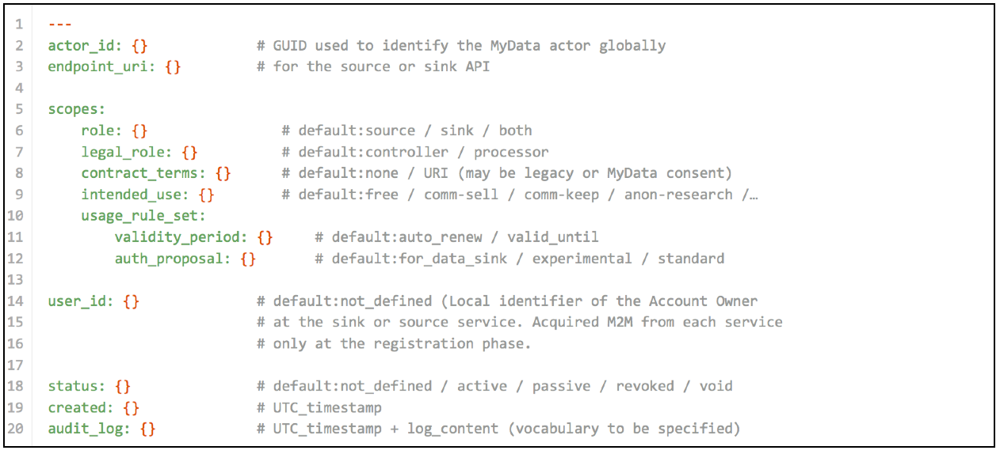
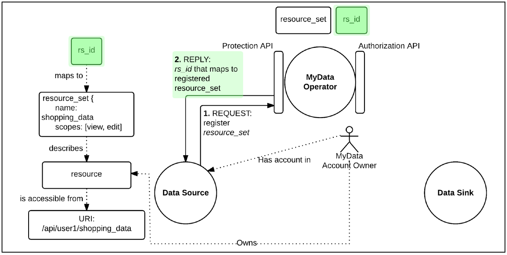
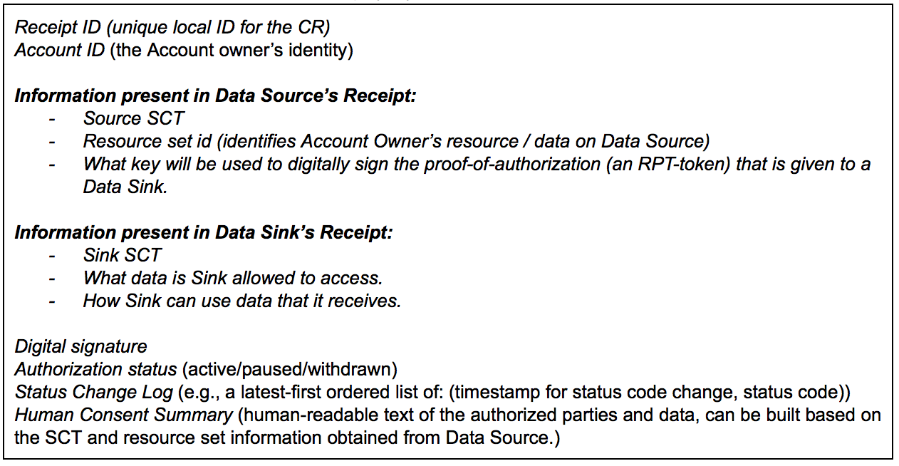
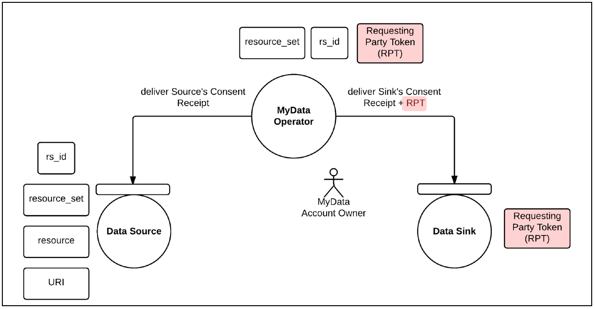
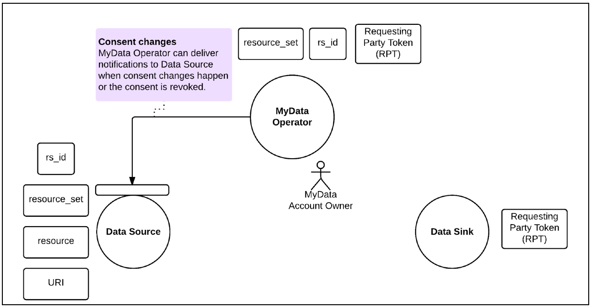
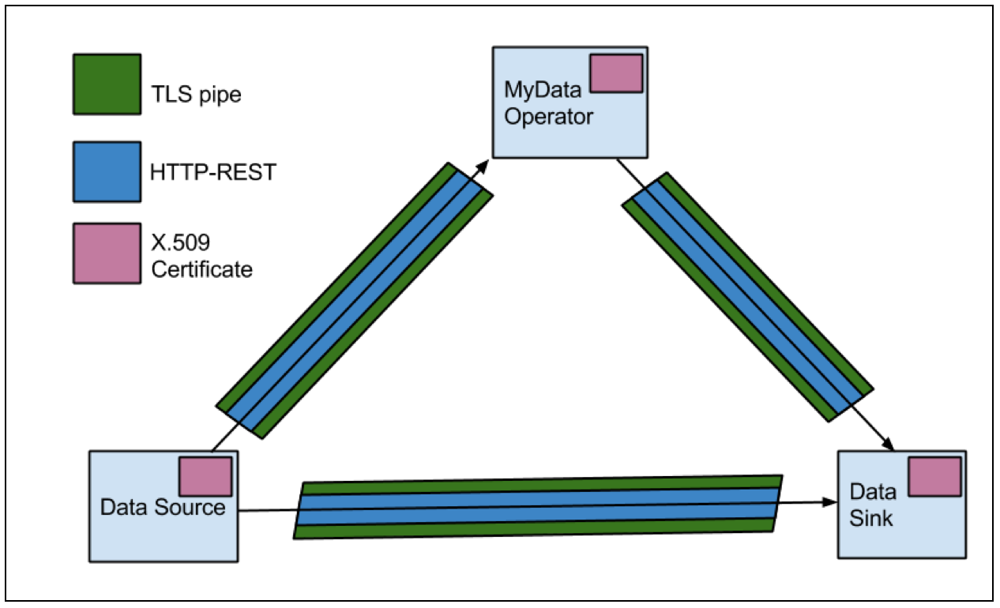

\begin{center}
\includegraphics{images/mydata_logo.png}
\end{center}

**Authors:**

| Nomi Byström  	Aalto University
| Harri Hirvonsalo	University of Oulu
| Harri Honko   	Tampere University of Technology
| Antti Kallonen	Tampere University of Technology
| Yki Kortesniemi	Helsinki Institute of Information Technology
| Kai Kuikkaniemi	Helsinki Institute of Information Technology
| Ilari Maarala 	University of Oulu
| Ilkka Niskanen	VTT Oy
| Antti Poikola 	Helsinki Institute of Information Technology
| Mika Rautiainen	University of Oulu
| Samuli Tuoriniemi	University of Oulu

**Version:**

| 1.0.0 (May 14th 2015)
| See updated versions from:[hiit.github.io/mydata-stack](https://hiit.github.io/mydata-stack/)

\newpage

# Part 1 - Introduction

The simple core idea, the **_individual in control of their own data_**, is both a movement for digital human rights and an initiative for opening new business opportunities. Though both of these goals can be achieved within the current legal framework, the lack of interoperable implementations has kept them mostly a distant goal - a situation that we now want to change.

In this document we present the MyData architecture, a human centric approach to liberate the potential of personal data and to facilitate its controlled flow from multiple Data Sources to applications and services. It responds on a practical and technical level to individuals growing demand for control over their own digital identity and to organizations need to fulfill the requirements of tightening data protection regulation.

Currently, applications and services collect increasing amounts of personal data about individual users and use it to extract valuable knowledge about them. This information can be used for profiling individuals, and the results are monetizable input for e.g. targeted advertising. Individuals typically have little or no control over how their data is created or used.

MyData approach proposes a paradigm shift by introducing a human centric model that aims to give control of the produced data back to the individuals. The model is envisioned to liberate the usage of personal data by letting individuals to choose how their data can be used by third party organizations. The assumption is that individuals are autonomous actors and the best experts to understand the utility of data about themselves in different applications, and therefore the data will be put to best possible use for the benefit of the individual. 

In contrast to more relaxed data in e.g. social media services, according to EU data protection (and US), the processing of data concerning health is more strictly regulated. These characteristics make health data a good domain to research and develop MyData system models in various scenarios. However, health is not the only domain benefiting of the model - more casual data, e.g. personal interests, food and media consumption habits, can also be shared according to MyData model to help individuals have better control over service-specific recommendations, targeted advertisements and other applications that necessitate personal profiling. People might even be able to monetize their data themselves.

The legal framework for protecting personal data starts with free, informed, specific and explicit consent. In order for their personal data to be processed, the individual has to make a conscious choice to give consent to the external organization to process data. This is the exact premise chosen as key guiding rule of the developed MyData model. The implementation of the consent mechanism has been inspired by  [OpenID Connect](http://openid.net/connect/) and [User-Managed Access (UMA)](https://kantarainitiative.org/confluence/display/uma/Home) specifications to authorize sharing and use of personal data resources in the online environment.

A central element in the architecture is the *MyData Account*, a place for viewing, managing and controlling the consents enabling the flow of personal data. MyData Account model makes it possible to execute lawful information requests cost effectively and in standardized manner. Model also empowers individuals to examine, link, re-use and constrain their personal data in ways that has not been possible with the prevailing paradigm of uneven collection and use of personal data. The architecture aims to provide a standard for implementations that

* satisfy the legal requirements for processing of personal data and, thus, prevents unwanted and improper processing of the individual’s personal data 

* enable the individuals to easily grant and withdraw their consent for data processing

* provide transparency to individuals about how their data is being used

* enable flexible service creation and new business opportunities

In the following sections we present an overview of the MyData Architecture, provide a technical description of the data flow implementation and detail some future directions for the Architecture. This is first version of the specification and will be developed upon feedback.
\newpage

# Part 2 - MyData Architecture overview

This part provides an overview of the MyData architecture. It introduces the core concepts of the architecture, details the legal basis for processing of personal data, and describes the main transactions required for data mobility.

## 2.1 Core Concepts

Key concept in MyData architecture is the **MyData Account** which enables individuals to manage the flow of their personal data from many data sources to the services which use the data. There are four operational roles in the My Data architecture: **Account Owner** , **MyData Operator**, **Data Source** and **Data Sink** as illustrated in Figure 1. Actors (organizations and individuals) may work in one or many of the operational roles. It is very typical for example that same organization is in the role of Data Source and at the same time also in the role of data Sink. We shall next go over each role in more detail.

*Figure 1. Core concepts of the MyData Architecture: MyData Account Owner, the individual managing access to their data, MyData Operator, the service that provides a MyData Account for storing the authorizations, Data Source, the service providing access to the individual’s data, and Data Sink, the service utilising the data.*

### 2.1.1. MyData Account

The account metaphor is familiar e.g. from bank, email, and customer accounts . Functionally MyData Account is the key enabler in authorizing, controlling and logging the data flow between Data Sources and Sinks. MyData Account stores all Service Contracts and Consent Receipts that define access means and rights for Data Sinks and Data Sources as well as the Data Usage Log resulting from authorized Data Connections.

Typically the accounts are provided by organizations acting in the operator role. In MyData Architecture the operator role is also defined (see *Figure 2*) and it is expected that most of the MyData Accounts will be provided by some organizational MyData Operator. However, it is also possible for individuals to run the operator server software themselves and become self-operators, and therefore have functional MyData Account independently of any organization.

### 2.1.2. MyData Account Owner

Account Owner is the person who created and is using the account to link new services (see *Service Connection*) and authorize data flow (see *MyData Authorization*). Account Owner is usually the Data Subject as defined in Data Protection legislation. One person may have multiple accounts, but accounts may also be shared with multiple people. The Account Owner has control over her account settings. 

Depending on the account type and offered security level, the owner may be strongly authenticated, be known by a pseudonym or even be completely anonymous, and the formal registration mechanism of accounts may vary (ex. strong, 2-phase authentication or simple email account/password mechanism). In some domains, such as sensitive health data, the Data Sources may require certain level of security and authentication based on the legal demands. For example, if a person wants to use a MyData Account in a public healthcare service, there might be government regulations that require the use of strong authentication. 

### 2.1.3. MyData Operator

Principal purpose of the MyData Operator is to provide MyData Accounts and the user interface for  managing those accounts. Operator also needs to provide the underlying mechanisms for connecting Data Sources and Data Sinks to the account and creating and managing MyData Authorizations. The architecture enables the existence and use of multiple operators. Each individual can choose to use one or more operators to manage their consents.

Operator may also provide specific value-added services such as additional security e.g. by certifying the Actors, local applications for visualizing and monitoring data, data storage, service brokerage, data semantics, intention modeling, profile information, data anonymization or answer services (such as [OpenPDS](http://www.openbsd.org)). At this point the account specification has not been defined to cover value-adding features, but in future the MyData Account specification may be extended to cover also such features. 

Figure 2 depicts the MyData Operator stack that always includes the required components, which enable the key functionality of MyData Architecture: creating and managing of Accounts, Service Connections and Authorizations, and can also include optional components to provide additional functionality. 

*Figure 2: The MyData Operator Stack shows the required and optional functionalities of MyData Operator*

### 2.1.4. Data Sources and Data Sinks

Data Source is an entity that can provision data about the Account Owner to one or more Data Sinks and correspondingly Data Sink is an entity that can capture data from one or more Data Sources and uses this data to produce new applications and services. Both Data Sources and Sinks need to provide a [MyData compliant API](#bookmark=id.6g01wecbh0ps). Data Source API allows management of data provision, while the Sink API allows management of data usage. It is quite common that same service is both working as Data Source and Data Sink and providing, therefore, both Sink and Source capabilities.

Data Source and Data Sink are general high level operational roles. There are special types of Data Sources such as a proxy, a data logger, a data store and an MyData Account as a Data Source. There are also special types of Data Sinks such as applications hosted by the individual, physical devices, aggregator (aggregation over multiple identities), data synthesis (aggregation over multiple data sources of same individual) and anonymizer to mention few.

## 2.2. Legal Basis

A central question in processing personal data is who decides when and how an individual’s personal data is processed: that person or others? According to international regulation of data protection, such as the EU Data Protection Directive[^1] or the Charter of Fundamental Rights[^2], there are several legal bases for processing personal information.  For example, others may process personal data on the basis of contracts, legal obligation, etc. without consent from the individual.

[^1]: [95/46/EC of 24 October 1995](http://eur-lex.europa.eu/LexUriServ/LexUriServ.do?uri=CELEX:31995L0046:en:HTML)
[^2]: [2010/C 83/02](http://eur-lex.europa.eu/legal-content/EN/TXT/?uri=CELEX:12010P)

However, at the heart of the rights of the individual, ‘the Data Subject’, is that personal data is processed on the basis of that individual’s explicit consent. Consent is also the very foundation of the MyData architecture approach: data processing is always based on the individual’s consent. For consent to be valid, is has to fulfill a number of legal requirements -  and in the EU these requirements are about to change due to the upcoming EU General Data Protection Regulation, the GDPR[^3].

[^3]: The new EU-wide regulation will be based on Proposal for a regulation of the European Parliament and of the Council on the protection of individuals with regard to the processing of personal data and on the free movement of such data.

The MyData Account based system architecture incorporates the increasing legal requirements regarding consent, the rights of the data subject, and other demands relating to processing as being enacted in the GDPR.

It should be noted that GDPR is not yet in force and still being amended. Thus, as of spring 2015, the final legal obligations relating to data processing are not yet known. However, their development and changes are being closely followed and, if needed, this MyData specification will be adjusted to the changes.

### 2.2.1. Consent

Consent is the permission to process personal data and it is always given by the Data Subject to the Data Controller. To be legally valid, the Data Subject needs to give unambiguous consent to the processing of their data for *specific purposes*, and the consent has to be *free*, *informed* and *explicit*. Consents can be specifically created or they can be part of a larger legal contract between the individual and services they use.

In MyData architecture consent is a central concept as all data transactions and -processing are based on valid consents from the Data Subject. It allows Data Subjects to decide how their personal data are being used and make decisions about how they can be used in the future.  This approach is also geared towards the requirement that withdrawal of consent has to be as easy and swift as giving it. The MyData Account infrastructure makes it technically feasible to change or withdraw the consent as needed. This applies to all types of personal data, irrespective of whether they belong to special categories of data, also known as sensitive personal data[^4]. 

[^4]: Special categories (as of May 2015 listed in the GDPR) include: personal data revealing racial or ethnic origin, political opinions, religious or philosophical beliefs, trade-union membership, genetic data, data concerning health or sex life, administrative sanctions, judgments, criminal or suspected offences, convictions or related security measures.

### 2.2.2. Legal and Operational Roles

In the data protection regulation there are a number of legal roles, most importantly the Data Subject, Data Controller and Data Processor which have differing rights and obligations. Data Subject is an identified or identifiable natural person whose personal data is processed. Data Controllers and Data Processors are either natural persons or legal persons, public authorities, agencies or other bodies. Data Controller alone or jointly with others determines the purposes and means of the processing of personal data and the Data Processor processes personal data on behalf of the Data Controller According to the GDPR (as of 12 May 2015) processing signifies any operation or set of operations performed upon personal data or sets of personal data, for example: "collection, recording, organization, structuring, storage, adaptation or alteration, retrieval, consultation, use, disclosure by transmission, dissemination or otherwise making available, alignment or combination, erasure or destruction".

For unambiguity it is important to make mapping between legal roles - Data Subject, Data Controller and Processor - and previously presented operational roles MyData Account Owner, Data Source and Data Sink. It is worth noting that the legal framework only covers cases of personal data where the Data Subject is a natural person, but the MyData architecture technically works equally for managing data of juridical persons, collectives or even anonymous Account Owners.

When the Account Owner is a natural person and their data is being processed, the Account Owner is the Data Subject. The other legal roles in MyData system can be then determined by answering two questions:

1. Who determines the purposes and means of the processing of personal data?

2. Who actually does the data processing?

Some typical cases are:

* **Repurposing:** The Data Source is also Data Sink processing personal data for a specified purpose - at some point they may suggest for the Account Owner a new purpose or means of processing data. In this case the Data Source is in legal terms the Data Controller.

* **Delegation:** The Data Sink accesses with Account Owners consent personal data from the original Data Source and processes it for a defined purpose. In this case both the Data Source and the Data Sink are in legal terms Data Controllers.

Beside these typical cases the MyData architecture finally makes technically feasible the long-anticipated concept, where the Data Subject can ultimately also act as her own Data Controller. The upcoming EU General Data Protection Regulation describes in its published terms a means to implement scenarios where an individual can act as Data Controller for their self-managed secondary data usage rules & terms over their self-managed personal data that can be re-used, and consents for these secondary or re-uses of the data are managed by the person themself. It states that an external actor (such as a service provider) can offer services related to this data without implicitly becoming a Data Controller. Of course in several cases the external actor may have internal interests or regulatory responsibilities that will trigger it also to be a Data Controller.

## 2.3. Transactions

At the highest level there are there are three main transaction types between Data Sources, Data Sinks and MyData Operator. All these transaction types result in digital records that are stored in the MyData Account.

1. **Service Connection:** Account owner links a new Data Source or Data Sink to their MyData Account

    Record: **Service Contract** is a record of an established Service Connection

2. **MyData Authorization:** Account owner authorizes a specific Data Source to provide data for a specific Data Sink and the Sink to use that data

    Record: A MyData authorization results in a pair of **Consent Receipts**, one each for the Data Source and the Data Sink

3. **Data Connection:** Data Sink establishes an authorized automatic data transfer from a Data Source to the Data Sink

    Record: All data connections are recorded in a **Data Usage Log**

### 2.3.1. Service Connection

Service Connection is an action executed by an Account Owner to link a service (Data Source or Data Sink) to their MyData Account. As the result the Service Connection status and parameters are documented within a digital machine-readable record, called a Service Contract. One legal party of the Service Contract is always an Account Owner. This digital contract defines how the Individual uses the service and whether connected service is a Data Source, a Data Sink or both. Contract’s machine-readable internal structure also defines technical information required for the data flow such as service API endpoint and agreed rules on how the data is to be handled. 

### 2.3.2. MyData Authorization

MyData authorization proves there exists Account Owner’s permission for active data transfer from a specific Source to a specific Sink. Authorization results in two legally valid consents which are documented in Consent Receipts attached to the Service Contracts with the Data Source (consent to give data out) and Data Sink (consent to use the data).

The Consent Receipts (as well as the Service Contracts) are machine-readable digital records stored in the MyData Account. The user interface of Account Management Service needs to be able to represent consent summaries in clear human-readable form in order to offer an unambiguous description of the consent. The creation of authorizations follows the [Privacy by Design principle](https://www.iab.org/wp-content/IAB-uploads/2011/03/fred_carter.pdf) and authorizations are, therefore, always as restrictive as possible.

The Account Owner can at will deactivate the authorization, in which case no new data is provisioned. However, the Data Sink is not otherwise notified of this status change. When the authorization is reactivated, it is data type dependent whether the data collected during the deactivation period becomes available to the Data Sink or not. An example use case would be Account Owner’s location data, which can be made unavailable for a period and the data for this period will not become available even after reactivation.

### 2.3.4. Data Connection

A Data Connection is the event where an authorized transfer of MyData Account owner’s data from Data Source to Data Sink is made. After a MyData Authorization is created, multiple data connection events may happen from data source to data sink as long as the authorization is not deactivated or withdrawn. In order for a Data Connection to happen, a Data Sink must first make a request-for-data to the Data Source, providing proof-of-authorization (proof that this Data Sink is authorized to fetch data from a Data Source) with this request.

Occurrence of Data Connections between Data Source and Data Sink are recorded in a Data Usage Log. This log can be can be used for auditing purposes (c.f. the current databases used in hospitals that automatically log each time when someone accesses medical records so that any unauthorized use can later be acted upon).
\newpage

# Part 3 - Technical Implementation of MyData Architecture

This section presents the technical implementation of the MyData architecture. Presented data flow model covers the steps needed to establish a Data Connection between Data Sink and Data Source and follows the same three main steps defined in the earlier *Transactions section*: Service Connection, MyData Authorization and Data Connection. 

## 3.1. Data flow model

Implementation of the data flow model in the MyData architecture is based on the  [OpenID Connect](http://openid.net/connect/) and [User-Managed Access (UMA)](https://kantarainitiative.org/confluence/display/uma/Home) specifications. UMA defines an implementation for a data connection between two (previously unrelated) services - one providing user’s personal data, one wishing to have access to the data - so that a human user can securely manage the access to their data. MyData Architecture follows the UMA model and APIs whenever suitable. However, as MyData Architecture introduces the MyData Operator role that helps introduce the Sources and Sinks to each other, we are able to simplify the authorization process compared to the original UMA specification.

### 3.1.1. Resource Sets

A key concept for the data flow model is Resource Set: it defines a specific (subset) of the Data Subject’s data that a particular Data Source provisions. Data Source can provision the original data set in different ways by defining different Resource Sets. In MyData Architecture the Data Source contacts the MyData Operator using the Protection API and registers the Resource Set. After this, the Resource Set can be used in Mydata Authorization and each authorization then refers to a particular Resource Set.

### 3.1.2. Interfaces of different actors

There are four main interfaces in MyData Architecture. MyData Operator provides a *Protection API* for the Data Source. This API defines methods for Data Source to 1) register Resource Sets to MyData Operator and 2) introspect received data access tokens from Data Sink. Protection API is protected by OAuth 2.0-protocol and thus each message Data Source sends to this API must contain an access token, which in this case is called a Protection API Token (PAT). 

In a similar fashion, MyData Operator provides an *Authorization API* for the Data Sink. This API defines methods for Data Sink to receive 1) Requesting Party Tokens (RPT) and 2) Consent Receipts for accessing data provided by Data Sources. Each message Data Sink sends to this API, must contain an Authorization API Token (AAT).

In order for Data Sink and Data Source to get their relevant access tokens, they must provide OAuth 2.0 defined Authorization Grant and "exchange" it for an access token through Operator’s APIs - Protection API for Data Source and Authorization API for Data Sink.

Both the Data Source and Data Sink must provide an MyData Compliant API (*Data Source API* and *Data Sink API*, respectively) for MyData Operator, through which MyData Operator can deliver Consent Receipts, RPT tokens (only for Data Sink), PAT tokens (only for Data Source)  and notifications about changes in consent.

Before Service connection, MyData authorization and Data Connection phases can happen all of the communicating parties must be known. From technical perspective, this means that when connecting Data Source to Data Sink with MyData Operator, these services must know which API endpoints of each other they must call on the network level and what are their identities. These service endpoints can be related to communicating parties either at service level when registering Data Source and Data Sink services to MyData Operator or they can be discovered from dynamic service linking URIs. Choice of endpoint address delivery depends on operator implementation and required security level.

All interfaces in this document are HTTP based RESTful APIs. Structure of security tokens (RPT, PAT, AAT, etc.) used in this data flow model is JSON Web Token (JWT).

In addition to Protection API, Data Sources are expected to provision their data through Resource Set API, which allows Data Sources to connect different types of data resources through resource locator URI and independent resource URIs. According to REST paradigm, it is good practice to separate different resource sets through different URIs that are derivable from common locator URI. These resource set apis are registered at the Data Operator for utilization.

### 3.1.3. Service Connection

The first step for a MyData Account Owner that wants to manage access to his/her data on a Data Source through MyData Operator, is to make Service Connection with this Data Source. In a similar fashion, the Account Owner must make a Service Connection with a Data Sink, but in this case the Service Connection specifies what kind of data a particular Data Sink is to access and how a particular Sink is to use this data.

The creation of a Service Connection requires that the Data Sources and Sinks provide a MyData Service Contract Template (SCT), and publish their template ( Table 1 presents the tentative contents of a SCT) at MyData Operator’s service registry. The registration process has not been specified in this version of the document.

*Table 1: Tentative structure for a Service Contract template (SCT), all fields will be defined in later versions of this architecture document.*

A Service Contract  is created by filling in the required information and signing it with the Account Owner’s and Actor’s keys. Signing binds the document to a specific Account Owner and Actor. The record is stored in the MyData Account.

It is assumed that the Account Owner making a Service Connection with a Data Source, has an account and has or will have data stored in the Data Source. The data is then provisioned as Resource Sets, which are identifiers for a specific set of data. Data Sink’s Consent Receipt (see *Table 2*  for the contents of a Consent Receipt)  use a Resource Set to define what resources residing on the Data Source the Data Sink is allowed to access.

*Figure 3: Service Connection example- resource registration process that happens after a Service Connection has been made*

Forming a Service Connection with a Data Source triggers a resource registration process, which is presented in *Figure 3*. In the resource registration process, Data Source begins registering Account Owner’s resources to MyData Operator, presenting them as the aforementioned Resource Sets (1). Upon receiving this resource registration request MyData Operator stores the received Resource Set, generates a resource set id (rs_id) that maps to this specific resource set (on this specific Data Source) and sends this *rs_id* as a reply to Data Source (2). Data Source associates the received rs_id with the resource set that it requested the registration for. Resource registration process ends after all the resources have been registered. New Resource Sets can later be defined, if e.g. new types of data becomes available or if the Account Owner wishes to define a new subset of data to provision.

Resource set identifier (rs_id) is composed of a resource locator URI that identifies the Data Source and resource key (a nonce) that identifies the resource inside the specific Data Source. URI and the resource key must not leak out any specific information about the user or data but only provide reference to the Data Source e.g. *datasource.fi/resource/a3h413h4b13h41*. By using rs_id’s, both parties can refer to a specific resource set and Data Source using the rs_id as an globally unique identifier. This makes it easy to implement, for example, Consent Receipts that explicitly identify what data Account Owner has allowed a Data Sink to access.

### 3.1.4. MyData Authorization

After a Service Connection with a Data Source has been made, a Data Sink can be authorized to access data on that Data Source by conducting MyData Authorization step. The Authorization results in a pair of Consent Receipts. In the first, Account Owner gives an explicit consent for particular Data Sink to access a specific Resource Set on that particular Data Source (depicted in the Data Source’s Consent Receipt). In the second, Account Owner also authorizes Data Sink to process the specified data according terms defined in the Data Sink’s Consent Receipt. The contents of a Consent Receipt are depicted in *Table 2*. So both Data Source and Data Sink have their own Consent Receipt, which contain role specific information necessary in establishing a Data Connection between Data Source and Data Sink. URI that points to Data Source’s API endpoint, where the data defined in the Consent Receipt can be accessed, is one example of such information.

*Table 2: Tentative data elements in a Consent Receipt (CR)*

Upon creation of Consent Receipts, MyData Operator delivers each Receipts to their relevant relevant receivers as shown in *Figure 4*. Data Sink’s Receipt is delivered to Data Sink and Data Source’s Receipt is delivered to Data Source. In addition, MyData Operator generates a Requesting Party Token (RPT), which is delivered to the Data Sink. This RPT token serves as a proof-of-authorization, which Data Sink uses when making data requests to the Data Source. RPT is contained in each Data Connection request the Data Sink makes towards Data Source.

*Figure 4: MyData Authorization*

### 3.1.5. Data Connection

Third step of MyData architecture data flow model is Data Connection, where Data Sink authorized to fetch data makes a request containing a proof-of-authorization (RPT token) to Data Source that stores the data. Data Source receiving such request, must check the validity of the provided proof-of-authorization. Validity check is needed in order to check that user hasn’t withdrawn or paused the given authorization, i.e. the authorization is still active.

The actual data flow from Data Source to Data Sink is presented in Figure 5. In the first step Data Sink makes a request to Data Source to access specific data (1). This request contains the MyData Operator generated Requesting Party Token (RPT) which serves as proof-of-authorization for the Data Sink service. RPT relates to a specific Resource Set in the Data Source.

After receiving the RPT, Data Source verifies that the token is (still) valid, by making a request (known as *introspection*) to Data Operator. (1.1). Operators response contains confirmation that the token is active and what are the current data modify operations for the resource set Data Sink requested (1.2). Finally Data Source delivers the resource set referred by RPT to the requesting Data Sink (2).

*Figure 5: Data Connection*

After the initial introspection, Data Source stores the reply and as long as the reply remains valid, it can be used to validate RPT without further introspection. Thus the introspection steps (1.1 and 1.2) can be performed only periodically as required. As introspection presumably takes considerable amount more time compared to verifying the digital signature of the token, this time-to-time introspection enables more efficient data transfer between Data Source and Data Sink.

Considering both validation checking mechanisms, RPT’s expiration time also has to be taken into account, as RPT is valid only if the expiration time of the token hasn’t exceeded. If an RPT’s expiration time is exceeded, Data Sink must request a new RPT from MyData Operator. Steps to request and acquire the new RPT are not presented in the diagram. All Data Sources have to log all Data Connections (even attempts) for auditing purposes.

### 3.1.6. Changes to a Consent

Account Owner might make changes to or withdraw the whole consent given to a Data Sink at any time during the lifetime of this Data Sinks Service Connection, at which point the affected Data Source and Data Sink should be informed about these changes as soon as possible. *Figure 6* presents an API that Data Source provides for these consent change notifications. Upon receiving such notification from the MyData Operator, Data Source must immediately act and change its processing of request made by Data Sink, according to information presented in the notification. For example, if Account Owner withdraws a consent, MyData Operator notifies Data Source about the change and the Data Source will  deny / reject further requests that concern data defined in the withdrawn consent. If a Data Source is processing request at the time it receives a consent change notification, it checks if the information presented in the notification concerns the request-under-processing and updates its request processing if needed.

A corresponding Sink API is used to notify the Sink about the change (this is not depicted in the Figure).

*Figure 6: *Consent changes and withdrawal

## 3.2. Communication encryption mechanisms

All data transfers between Data Source, Data Sink and MyData Operator are secured with Transport Layer Security (TLS), which encapsulates the HTTP-REST payload protocol. In order to use TLS, these communicating parties must have an standard X.509 certificate that uniquely identifies services who are transferring data. For development purposes this certificate can be self-signed but for deployment environments it needs to be certified by a trusted certificate authority. When establishing the secure channel the communicating parties must check the signature, expiry date and the revocation status of all certificates in the other party’s certificate chain and reject if check fails. All the entities within single MyData Operator domain must have access to same trusted and synchronized time source. Each entity should try to maintain the time and synchronize their clock only when needed. Communication between parties must not proceed if either of the communicating parties notices that their clocks are out of sync. In this case parties should synchronize their clocks with trusted time source before re-establishing the connection.

*Figure 7: Secured communication channels between MyData services.*

### 3.2.1. Actor Revocation 

Each MyData actor has a X.509 certificate that uniquely identifies the actor. Certificate’s validity is verified as required in the certificate using Online Certificate Status Protocol (OCSP) or other suitable mechanism and only valid certificates can be used for establishing SAC between actors. Certificate’s issuer can revoke actors certificate in which case the actor can not any longer participate in MyData transactions. Actor revocation can happen for example due to compromised private key or due to policy violation. The actual reasons and policies for actor revocation are business decisions and are not specified in this document.
\newpage

# Appendix 1: Glossary

**Account Management Service (UI) -** User interface and related service for managing MyData Accounts, Service Connections and MyData Authorizations. This service may be offered by MyData Operator (organization taking the operator role), or the individual may run the the software herself (operator-less accounts or self-operator).

**Account Owner (role) -** Account Owner is the person who originally created MyData account. Depending on the account type the owner may be strongly authenticated or even anonymous. In case of individuals, the Account Owner usually is the same as the data subject.

**Actor ID -** A string that uniquely identifies the actor.

**Consent (lawful basis) -** Consent is the permission to process personal data and it is always given by the Data Subject to the Data Controller. To be legally valid, the Data Subject needs to give unambiguous consent to the processing of his/her data for specific purposes, and the consent also has to be free, informed and explicit. Consents can be part of a larger (not just MyData-context) legal contract between the individual and services the individual uses.

**Consent Receipt (record) -** A pair of Consent Receipts (one for the Source and one for the Sink) is created as a result of a MyData authorization.  For the Source it defines, what data can be provisioned to the specified Sink, and for the Sink it defines, how the data can be accessed and processed. A Consent Receipt is a manifestation of legally valid Consent and makes it technically feasible to change or withdraw the consent dynamically.

**Data Connection -** is an authorized transfer of data from Data Source to Data Sink.

**Data Controller (legal role) -** A natural or legal person, public authority, agency or other body which alone or jointly with others determines the purposes and means of the processing of personal data. 

**Data Processor (legal role) -** A natural or legal person, public authority, agency or any other body which processes personal data on behalf of the data controller. A role that is not defined in U.S. privacy legislation so far.

**Data Subject (legal role) -** An identified or identifiable natural person whose personal data is collected and processed. The data subject (individual) has rights and practical means to control creation, flow and usage of his personal data. The data subject gives and manages Consents related to individual’s own data and Service Connections.

**Data Sink (role) -** Entity that can capture data from one or more Data Sources and allows management of data usage through a [MyData compliant API](#heading=h.juikezbkhwiy) and uses this data to produce new applications and services.

**Data Source (role) -** Entity that can provision data about the Account Owner to one or more Data Sinks and allows management of data provision through [MyData compliant API](#heading=h.juikezbkhwiy).

**Data Usage Log (records) -** Occurrence of Data Connections between Data Source and Data Sink are recorded in a Data Usage Log tha can be audited using  Account Management Service.

**MyData -** Subset of personal data. All MyData is personal data, but such personal data where the data subject has no practical means to get the data and control how it is used cannot be called MyData.

**MyData Account -** MyData account hosts all Service Contracts and Consent Receipts that define access means and rights for Data Sinks and Data Sources.

**MyData Authorization (interaction) -** An authorization proves there exists Account Owner’s permission for active data transfer from a specific Source to a specific Sink. When authorization takes place a pair of Consent Receipts (one each for the Source and the Sink) are created.

**MyData Compliant API -** Data sources and Sinks need to provide API which gives unique endpoint address recognizable for other MyData compliant services. Functionally the API needs to support 1.) access management through Service Connections and MyData Authorizations 2.) import and/or export of data through authorized Data Connections.

**MyData Operator (role) -** MyData (consent) operator provides MyData Accounts and the related Account Management Service.

**Personal Data (definition) -** All kinds of data related to the person or resulting from the person's activities. The term covers more than just the most personal information, such as name and address. It is also not strictly limited to the legal definition of personally identifiable information.

**Service Connection (interaction) -** Action executed by an Account Owner to link a service (Data Source or Data Sink) to their MyData Account. As the result the Service Connection status and parameters are documented within a digital machine-readable record, called a Service Contract.

**Service Contract (record) -** Service Contract is the formal outcome of a successful Service Connection. It documents in machine readable form the terms and scope of the agreement between the Individual (Account Owner) and a single Service (Data Source or Data Sink). Service Contracts are stored at the related MyData Account.